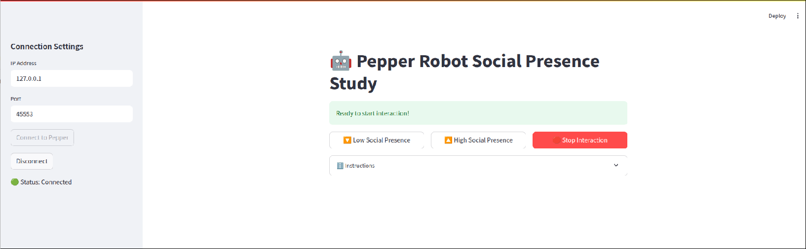

This project is a Streamlit-based web interface for interacting with the Pepper robot.

# Library Installation:
1. Streamlit
2. Qi Framework
3. Choregraphe

# App Installation
1. Clone the Repository:
'''python
'''git clone https://github.com/NipuniHW/SP_Measurement_Scale_Study.git
'''cd SP_Measurement_Scale_Study

2. Install Dependencies:
'''python
'''pip install -r requirements.txt

3. Run the Application
'''python
'''streamlit run script.py